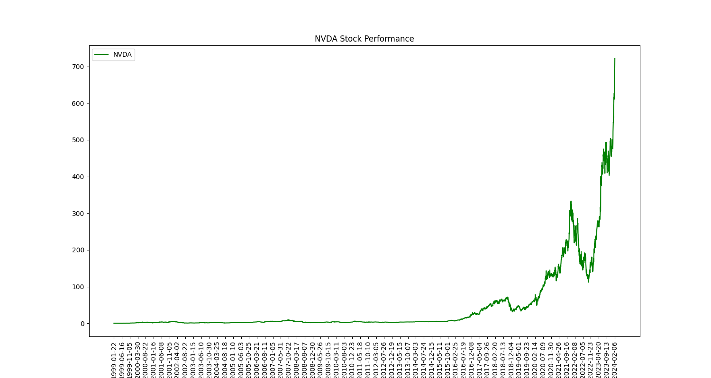

## **NVIDIA Corporation** 
longName: NVIDIA Corporation 
website: https://www.nvidia.com 
sector: Technology 
industry: Semiconductors 

### **Business Summary** 
NVIDIA Corporation provides graphics, and compute and networking solutions in the United States, Taiwan, China, Hong Kong, and internationally. The Graphics segment offers GeForce GPUs for gaming and PCs, the GeForce NOW game streaming service and related infrastructure, and solutions for gaming platforms; Quadro/NVIDIA RTX GPUs for enterprise workstation graphics; virtual GPU or vGPU software for cloud-based visual and virtual computing; automotive platforms for infotainment systems; and Omniverse software for building and operating metaverse and 3D internet applications. The Compute & Networking segment comprises Data Center computing platforms and end-to-end networking platforms, including Quantum for InfiniBand and Spectrum for Ethernet; NVIDIA DRIVE automated-driving platform and automotive development agreements; Jetson robotics and other embedded platforms; NVIDIA AI Enterprise and other software; and DGX Cloud software and services. The company's products are used in gaming, professional visualization, data center, and automotive markets. It sells its products to original equipment manufacturers, original device manufacturers, system integrators and distributors, independent software vendors, cloud service providers, consumer internet companies, add-in board manufacturers, distributors, automotive manufacturers and tier-1 automotive suppliers, and other ecosystem participants. NVIDIA Corporation was incorporated in 1993 and is headquartered in Santa Clara, California.
### **Employee Details** 
fullTimeEmployees: 29600 
majorEmployees: 
- Mr. Jen-Hsun  Huang: Co-Founder, CEO, President & Director 
- Ms. Colette M. Kress: Executive VP & CFO 
- Ms. Debora  Shoquist: Executive Vice President of Operations 
- Mr. Timothy S. Teter: Executive VP, General Counsel & Secretary 
- Mr. Ajay K. Puri: Executive Vice President of Worldwide Field Operations 
- Mr. Chris A. Malachowsky: Co-Founder 
- Mr. Donald F. Robertson Jr.: VP & Chief Accounting Officer 
- Prof. William J. Dally: Chief Scientist & Senior VP of Research 
- Ms. Simona  Jankowski C.F.A., J.D.: Vice President of Investor Relations 
- Mr. Robert  Sherbin: Vice President of Corporate Communications 
### **Recent Company News** 
title: Better "Magnificent Seven" Buy: Nvidia or Tesla 
link: https://finance.yahoo.com/m/1bbe9d4a-48bc-3be9-a524-2ba599baf88f/better-%22magnificent-seven%22.html 
publisher: Motley Fool 
 
title: 'Fail quickly and inexpensively': Nvidia founder and CEO Jensen Huang shares his mantra for success — here's why Jim Cramer calls him a bigger visionary than Elon Musk 
link: https://finance.yahoo.com/news/fail-quickly-inexpensively-nvidia-founder-130300123.html 
publisher: Moneywise 
 
title: Could Nvidia Be a Threat to Super Micro Computer? 
link: https://finance.yahoo.com/m/ce9c926f-1b46-3b37-86c8-ddde9699f0a1/could-nvidia-be-a-threat-to.html 
publisher: Motley Fool 
 
title: Dow Jones Futures: Coinbase Rockets To New High; Unity Stock Plunges 19% On Earnings 
link: https://finance.yahoo.com/m/0048296b-4e30-33a4-b97c-23d370f2e3b4/dow-jones-futures%3A-coinbase.html 
publisher: Investor's Business Daily 
 
title: History Says Nvidia's Stock Will Fall for 1 Simple Reason 
link: https://finance.yahoo.com/m/bc18f63e-e36a-3f1b-ab2c-2b7d150f7ee5/history-says-nvidia%27s-stock.html 
publisher: Motley Fool 
 
title: Will Nvidia Be a $3 Trillion-Dollar Stock by 2025? 
link: https://finance.yahoo.com/m/390fd110-0943-3c10-a032-d96c2fab285f/will-nvidia-be-a-%243.html 
publisher: Motley Fool 
 
title: Nvidia Stock Has 12% Upside, According to 1 Wall Street Analyst 
link: https://finance.yahoo.com/m/7c24ddcf-bdb3-3f0b-9f51-0f8699744a7c/nvidia-stock-has-12%25-upside%2C.html 
publisher: Motley Fool 
 
title: Corporate AI Investment Is Surging, to Nvidia’s Benefit 
link: https://finance.yahoo.com/m/0842a888-1021-3227-adc0-89f68f0b8b73/corporate-ai-investment-is.html 
publisher: The Wall Street Journal 
 
### **Investor Data** 
 
 
### **Latest Financials** 
#### General Financials 
totalRevenue: 60921999360 
totalDebt: 11056000000 
totalCash: 25984000000 
enterpriseValue: 1952597016576 
bookValuePerShare: 17.442 
marketCap: 1948049866752 
#### Liquidity Ratios 
 
 
### Technical Information 
