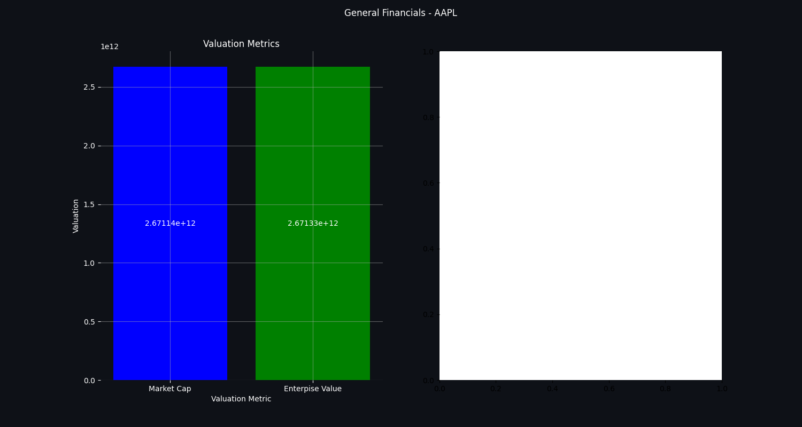
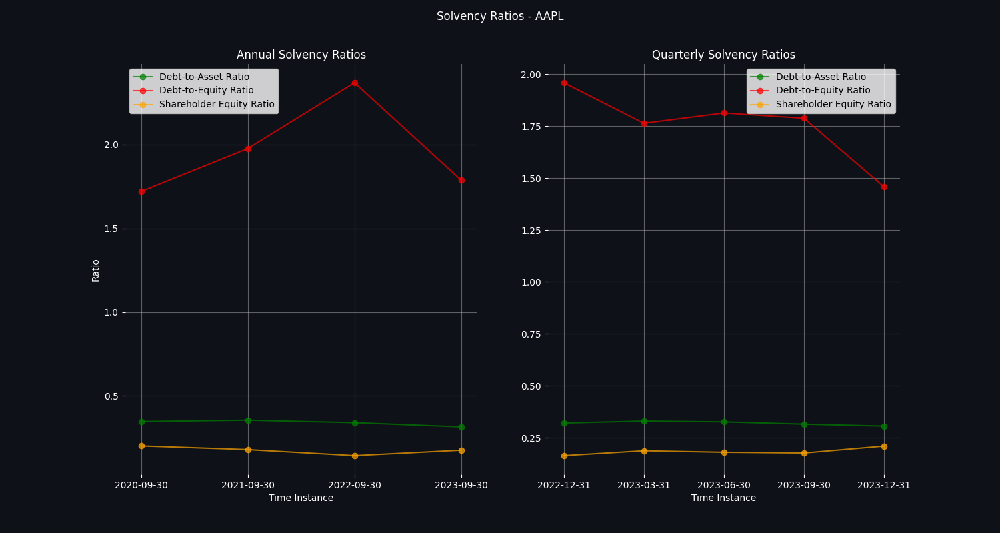
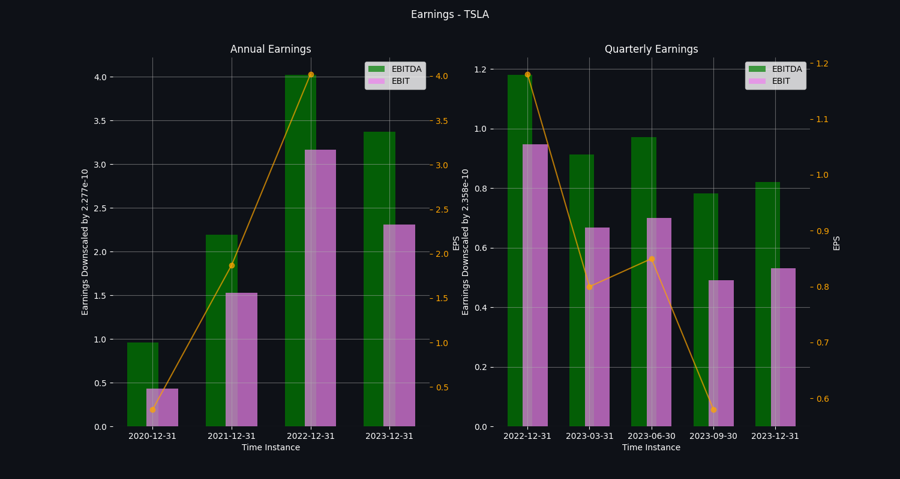

## **NVIDIA Corporation** 
longName: NVIDIA Corporation 
website: https://www.nvidia.com 
sector: Technology 
industry: Semiconductors 

### **Business Summary** 
NVIDIA Corporation provides graphics, and compute and networking solutions in the United States, Taiwan, China, Hong Kong, and internationally. The Graphics segment offers GeForce GPUs for gaming and PCs, the GeForce NOW game streaming service and related infrastructure, and solutions for gaming platforms; Quadro/NVIDIA RTX GPUs for enterprise workstation graphics; virtual GPU or vGPU software for cloud-based visual and virtual computing; automotive platforms for infotainment systems; and Omniverse software for building and operating metaverse and 3D internet applications. The Compute & Networking segment comprises Data Center computing platforms and end-to-end networking platforms, including Quantum for InfiniBand and Spectrum for Ethernet; NVIDIA DRIVE automated-driving platform and automotive development agreements; Jetson robotics and other embedded platforms; NVIDIA AI Enterprise and other software; and DGX Cloud software and services. The company's products are used in gaming, professional visualization, data center, and automotive markets. It sells its products to original equipment manufacturers, original device manufacturers, system integrators and distributors, independent software vendors, cloud service providers, consumer internet companies, add-in board manufacturers, distributors, automotive manufacturers and tier-1 automotive suppliers, and other ecosystem participants. NVIDIA Corporation was incorporated in 1993 and is headquartered in Santa Clara, California.
### **Employee Details** 
fullTimeEmployees: 29600 
majorEmployees: 
- Mr. Jen-Hsun  Huang: Co-Founder, CEO, President & Director 
- Ms. Colette M. Kress: Executive VP & CFO 
- Ms. Debora  Shoquist: Executive Vice President of Operations 
- Mr. Timothy S. Teter: Executive VP, General Counsel & Secretary 
- Mr. Ajay K. Puri: Executive Vice President of Worldwide Field Operations 
- Mr. Chris A. Malachowsky: Co-Founder 
- Mr. Donald F. Robertson Jr.: VP & Chief Accounting Officer 
- Prof. William J. Dally: Chief Scientist & Senior VP of Research 
- Ms. Simona  Jankowski C.F.A., J.D.: Vice President of Investor Relations 
- Mr. Robert  Sherbin: Vice President of Corporate Communications 
### **Recent Company News** 
title: Stocks Rise Ahead Of Fed's Guidance On Rate Cuts; Nvidia, Super Micro Fall 
link: https://finance.yahoo.com/m/a7176f35-fd32-3c29-a19a-43e1fa4dfdbb/stocks-rise-ahead-of-fed%27s.html 
publisher: Investor's Business Daily 
 
title: This New Artificial Intelligence (AI) Chip Is a Massive Game Changer for Nvidia Stock 
link: https://finance.yahoo.com/m/9a60a3ae-6307-3ee9-9e68-33027d8a4b9d/this-new-artificial.html 
publisher: Motley Fool 
 
title: Only One Other Mag 7 Stock Joins Nvidia On This Breakout Screen 
link: https://finance.yahoo.com/m/fce0a54f-aa85-31dd-b8a8-056176defb5a/only-one-other-mag-7-stock.html 
publisher: Investor's Business Daily 
 
title: Samsung stock up on potential Nvidia supplier reports 
link: https://finance.yahoo.com/video/samsung-stock-potential-nvidia-supplier-141233115.html 
publisher: Yahoo Finance Video 
 
title: Nvidia GTC AI conference: Everything investors need to know 
link: https://finance.yahoo.com/video/nvidia-gtc-ai-conference-everything-135417477.html 
publisher: Yahoo Finance Video 
 
title: Magnificent Seven Stocks To Buy And Watch: Nvidia Stock Slides 
link: https://finance.yahoo.com/m/4205eaa9-f620-3a0b-a81a-0e82c7c9fd0b/magnificent-seven-stocks-to.html 
publisher: Investor's Business Daily 
 
title: IBM Eyes First Record Since 2013 as AI Optimism Fuels 19% Rally 
link: https://finance.yahoo.com/news/ibm-eyes-first-record-since-114629010.html 
publisher: Bloomberg 
 
title: These Stocks Are Moving the Most Today: Chipotle, Boeing, PDD, Mobileye, Signet, BioNTech, Riot Platforms, and More 
link: https://finance.yahoo.com/m/d4dea9e3-6941-397a-aae4-3d538f6fe1c5/these-stocks-are-moving-the.html 
publisher: Barrons.com 
 
### **Investor Data** 
 
 
### **Latest Financials** 
#### General Financials 
 
#### Liquidity Ratios 
 
#### Solvency Ratios 
 
#### Profitability Ratios 
 
#### Earnings 
