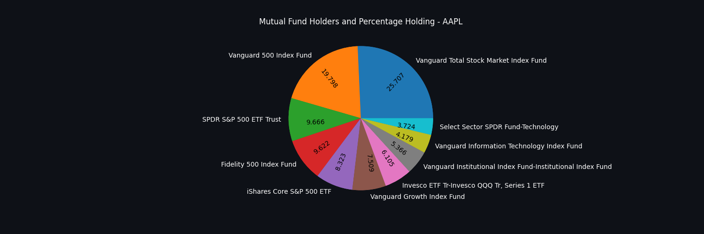
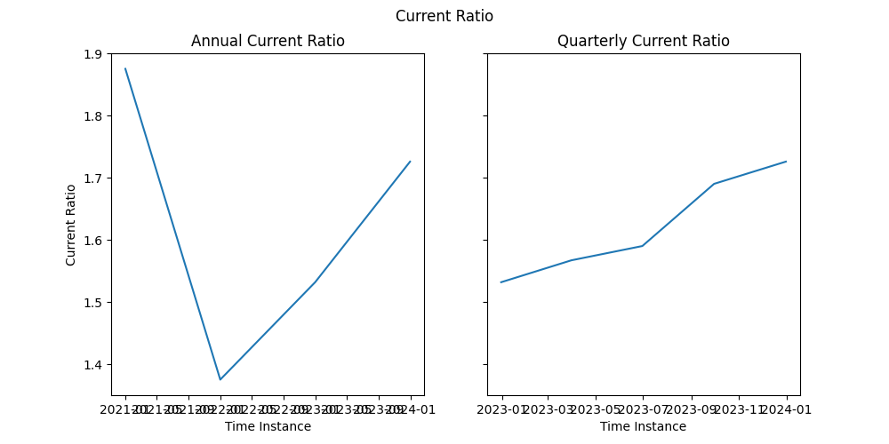
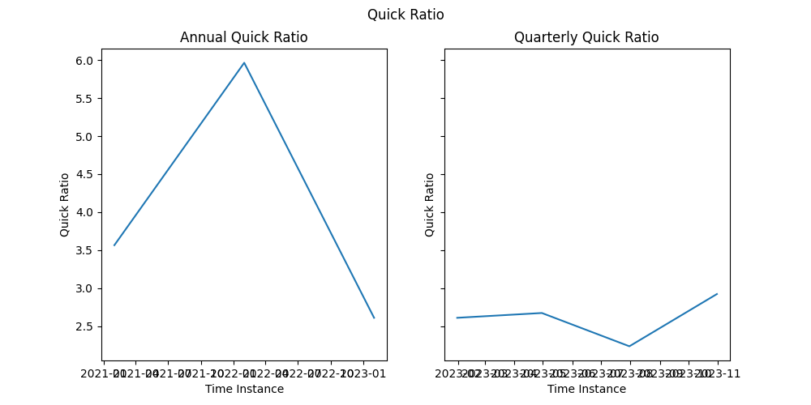

## **Hess Corporation** 
longName: Hess Corporation 
website: https://www.hess.com 
sector: Energy 
industry: Oil & Gas E&P 

### **Business Summary** 
Hess Corporation, an exploration and production company, explores, develops, produces, purchases, transports, and sells crude oil, natural gas liquids (NGLs), and natural gas. The company operates in two segments, Exploration and Production, and Midstream. It conducts production operations primarily in the United States, Guyana, the Malaysia/Thailand Joint Development Area, and Malaysia; and exploration activities principally offshore Guyana, the U.S. Gulf of Mexico, and offshore Suriname and Canada. The company is also involved in gathering, compressing, and processing natural gas; fractionating NGLs; gathering, terminaling, loading, and transporting crude oil and NGL through rail car; and storing and terminaling propane, as well as providing water handling services primarily in the Bakken Shale plays in the Williston Basin area of North Dakota. The company was incorporated in 1920 and is headquartered in New York, New York.majorEmployees: 
- Mr. John B. Hess: CEO & Director 
- Mr. John P. Rielly: Executive VP & CFO 
- Mr. Gregory P. Hill: COO and President of Exploration & Production 
- Mr. Timothy B. Goodell: Executive VP, General Counsel, Corporate Secretary & Chief Compliance Officer 
- Ms. Barbara J. Lowery-Yilmaz: Senior VP & Chief Exploration Officer 
- Mr. Richard  Lynch: Senior Vice President of Technology & Services 
- Mr. Jay R. Wilson: Vice President of Investor Relations 
- Lorrie  Hecker: Vice President of Communications 
- Mr. Andrew P. Slentz: Senior Vice President of Human Resources & Office Management 
- Jonathan C. Stein: Senior VP, CFO of Midstream & Chief Risk Officer 
### **Recent Company News** 
title: Top 12 Oil and Gas Stocks To Invest In According To Hedge Funds 
link: https://finance.yahoo.com/news/top-12-oil-gas-stocks-093928090.html 
publisher: Insider Monkey 
 
title: TotalEnergies (TTE) Q4 Earnings and Revenues Miss Estimates 
link: https://finance.yahoo.com/news/totalenergies-tte-q4-earnings-revenues-183300065.html 
publisher: Zacks 
 
title: Hess Achieves CDP Climate Change Leadership Status 
link: https://finance.yahoo.com/news/hess-achieves-cdp-climate-change-145700720.html 
publisher: Business Wire 
 
title: Why oil majors are reluctant to move away from fossil fuels 
link: https://finance.yahoo.com/video/why-oil-majors-reluctant-move-172616919.html 
publisher: Yahoo Finance Video 
 
title: Energy companies' Q4 earnings expected to decline the most among sectors 
link: https://finance.yahoo.com/news/energy-companies-q4-earnings-expected-to-decline-the-most-among-sectors-163512874.html 
publisher: Yahoo Finance 
 
title: Hess Corp. Boosts Bakken Output, Drilling Ahead of Chevron Merger 
link: https://finance.yahoo.com/news/hess-corp-boosts-bakken-output-161609335.html 
publisher: Hart Energy 
 
title: Hess (HES) Q4 Earnings Surpass Estimates, Revenues Fall Y/Y 
link: https://finance.yahoo.com/news/hess-hes-q4-earnings-surpass-155000428.html 
publisher: Zacks 
 
title: Here's What Key Metrics Tell Us About Hess (HES) Q4 Earnings 
link: https://finance.yahoo.com/news/heres-key-metrics-tell-us-150003693.html 
publisher: Zacks 
 
### **Investor Data** 
 
 
### **Latest Financials** 
#### General Financials 
totalRevenue: 10295000064 
totalDebt: 9598000128 
totalCash: 1688000000 
enterpriseValue: 52269355008 
bookValuePerShare: 29.185 
marketCap: 44928077824 
#### Liquidity Ratios 
 
 
