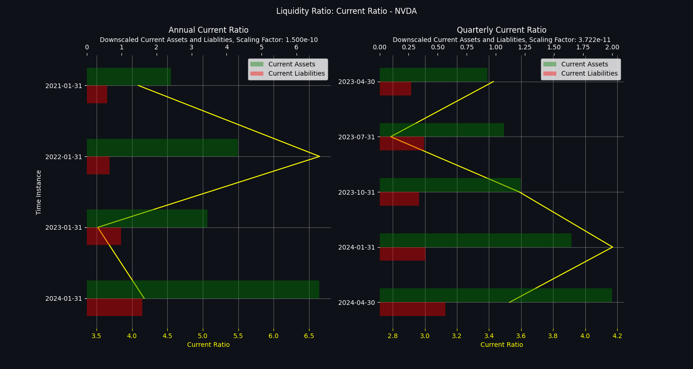
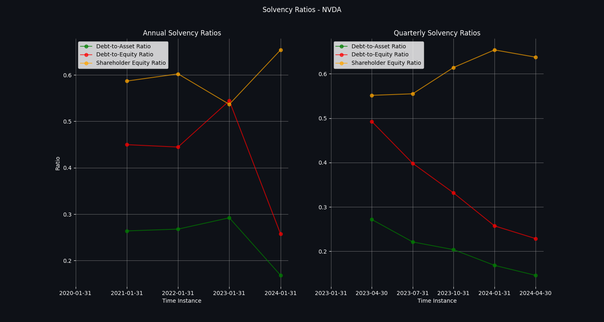

## **NVIDIA Corporation** 
longName: NVIDIA Corporation 
website: https://www.nvidia.com 
sector: Technology 
industry: Semiconductors 

### **Business Summary** 
NVIDIA Corporation provides graphics, and compute and networking solutions in the United States, Taiwan, China, Hong Kong, and internationally. The Graphics segment offers GeForce GPUs for gaming and PCs, the GeForce NOW game streaming service and related infrastructure, and solutions for gaming platforms; Quadro/NVIDIA RTX GPUs for enterprise workstation graphics; virtual GPU or vGPU software for cloud-based visual and virtual computing; automotive platforms for infotainment systems; and Omniverse software for building and operating metaverse and 3D internet applications. The Compute & Networking segment comprises Data Center computing platforms and end-to-end networking platforms, including Quantum for InfiniBand and Spectrum for Ethernet; NVIDIA DRIVE automated-driving platform and automotive development agreements; Jetson robotics and other embedded platforms; NVIDIA AI Enterprise and other software; and DGX Cloud software and services. The company's products are used in gaming, professional visualization, data center, and automotive markets. It sells its products to original equipment manufacturers, original device manufacturers, system integrators and distributors, independent software vendors, cloud service providers, consumer internet companies, add-in board manufacturers, distributors, automotive manufacturers and tier-1 automotive suppliers, and other ecosystem participants. NVIDIA Corporation was incorporated in 1993 and is headquartered in Santa Clara, California.
### **Employee Details** 
fullTimeEmployees: 29600 
majorEmployees: 
- Mr. Jen-Hsun  Huang: Co-Founder, CEO, President & Director 
- Ms. Colette M. Kress: Executive VP & CFO 
- Ms. Debora  Shoquist: Executive Vice President of Operations 
- Mr. Timothy S. Teter: Executive VP, General Counsel & Secretary 
- Mr. Ajay K. Puri: Executive Vice President of Worldwide Field Operations 
- Mr. Chris A. Malachowsky: Co-Founder 
- Mr. Donald F. Robertson Jr.: VP & Chief Accounting Officer 
- Prof. William J. Dally: Chief Scientist & Senior VP of Research 
- Ms. Simona  Jankowski C.F.A., J.D.: Vice President of Investor Relations 
- Mr. Robert  Sherbin: Vice President of Corporate Communications 
### **Recent Company News** 
title: Isn’t Nvidia (NASDAQ:NVDA) Stock Overvalued? Not Quite 
link: https://finance.yahoo.com/news/isn-t-nvidia-nasdaq-nvda-032248694.html 
publisher: TipRanks 
 
title: Tech Fund Beating 99% of Peers Says AI Rally Is Just Starting 
link: https://finance.yahoo.com/news/tech-fund-beating-99-peers-030839409.html 
publisher: Bloomberg 
 
title: Analysts revamp Super Micro Computer stock target after share offering 
link: https://finance.yahoo.com/m/ba23120a-0242-3875-92f5-b9378ec15189/analysts-revamp-super-micro.html 
publisher: TheStreet 
 
title: How Micron can remain competitive with Korean peers: Analyst 
link: https://finance.yahoo.com/video/micron-remain-competitive-korean-peers-213852224.html 
publisher: Yahoo Finance Video 
 
title: Nvidia Is Using Its Old 1990s Playbook To Best Its AI Rivals 
link: https://finance.yahoo.com/m/327ec9d4-0175-33a4-a94a-a8491779623d/nvidia-is-using-its-old-1990s.html 
publisher: Barrons.com 
 
title: Nvidia Pricing New AI Chips Aggressively To Maintain Market Share 
link: https://finance.yahoo.com/m/57616371-3510-3b18-9564-53e24653f364/nvidia-pricing-new-ai-chips.html 
publisher: Investor's Business Daily 
 
title: Nvidia Is One Of 2 Mag 7 Stocks On This Breakout Screen 
link: https://finance.yahoo.com/m/fce0a54f-aa85-31dd-b8a8-056176defb5a/nvidia-is-one-of-2-mag-7.html 
publisher: Investor's Business Daily 
 
title: These Stocks Moved the Most Today: Chipotle, Boeing, PDD, Mobileye, Signet, Riot Platforms, BioNTech, and More 
link: https://finance.yahoo.com/m/d4dea9e3-6941-397a-aae4-3d538f6fe1c5/these-stocks-moved-the-most.html 
publisher: Barrons.com 
 
### **Investor Data** 
 
 
### **Latest Financials** 
#### General Financials 
 
#### Liquidity Ratios 
 
#### Solvency Ratios 
 
#### Profitability Ratios 
 
#### Earnings 
